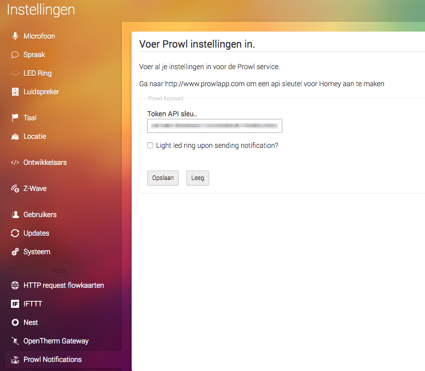
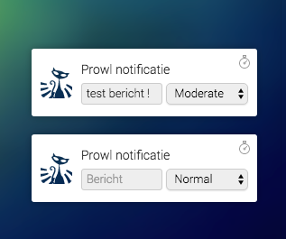

### Prowl notifications for Athom Homey

This app lets you send Prowl notifications to use in flows on a Homey device (by Athom).

1. Go to Prowlapp.com and login
2. Grab your Prowl API key
3. Go to settings on your Homey, and under Prowl Notifications fill in your API key and save.
4. use the Prowl notification action in your flows

### Credits

Most of the credits for this app go to Ton Versteeg, the author of de Pushover, Pushalot and Pushbullet app.

### Changelog

0.0.1

- Initial version based on the Pushover app created by Ton Versteeg

### ToDo

- Change from node-prowl Node-js modules to myprowl module
- Add use of provider key
- Strip non necessary modules from code

